# CineForge Local Asset and Workflow Integration Plan

**Date:** 2026-07-25
**Status:** Implemented (core path) — 2026-07-26
**Orchestration:** 48 logical agents
**Model assignment:** Intentionally blank for every agent
**Environment:** Local and private CineForge + ComfyUI installation

## User direction

This plan follows these decisions:

- Integrate all locally installed checkpoints, diffusion models, LoRAs, auxiliary models, and workflows.
- Keep checkpoint and diffusion model files physically under `ComfyUI/models/checkpoints`.
- Treat compatibility, metadata, and benchmark results as useful information, not approval gates.
- Do not hide locally installed assets because they are unreviewed, unbenchmarked, community-authored, or missing source metadata.
- Do not create commercial-use, licensing, admission, or production-approval restrictions.
- Let the user select any locally present model, LoRA, or workflow.
- Surface load failures and incompatibilities as clear runtime errors or warnings.
- Keep community AIO workflows available alongside canonical CineForge workflows.
- Make no implementation changes while this plan is being prepared.

## Target outcome

CineForge will provide one local asset catalog backed by the actual ComfyUI filesystem.

The catalog will include:

- every checkpoint and diffusion model in `models/checkpoints`;
- every LoRA under `models/loras`, including nested folders;
- text encoders, VAEs, upscalers, ControlNets, and other model components;
- every JSON, PNG-embedded, and ZIP workflow under `user/default/workflows`;
- source path, relative selector path, size, hash, safetensors metadata, and inferred family when available;
- duplicate and alias information without deleting files;
- model, LoRA, and workflow selectors in CineForge;
- ordered multi-LoRA stacks with user-controlled strengths;
- direct use by Storyboard Phase 6 and future video phases;
- queue execution, output collection, and run provenance.

All discovered assets remain visible. Metadata fields may be `unknown`.

## Architecture

```mermaid
flowchart LR
    Files["Local ComfyUI files"] --> Sync["Filesystem synchronization"]
    Sync --> Registry["Local asset registry"]
    Registry --> API["Runtime catalog API"]
    API --> UI["Models, LoRAs, workflows UI"]
    UI --> Request["Generation request"]
    Registry --> Resolver["Asset and workflow resolver"]
    Request --> Resolver
    Resolver --> Patch["Workflow graph patcher"]
    Patch --> Queue["CineForge queue"]
    Queue --> Comfy["Local ComfyUI"]
    Comfy --> Output["Collected output + run record"]
```



### Local registry

Add a general `local_runtime_assets` table instead of forcing every file immediately into a specialized model table.

Suggested fields:

- `id`
- `asset_type`
- `name`
- `file_path`
- `relative_path`
- `model_category`
- `file_extension`
- `file_size_bytes`
- `sha256`
- `metadata_json`
- `inferred_family`
- `inferred_base`
- `selector_value`
- `source_kind`
- `is_present`
- `first_seen_at`
- `last_seen_at`

Asset types include:

- `checkpoint`
- `lora`
- `workflow_json`
- `workflow_png`
- `workflow_zip`
- `text_encoder`
- `vae`
- `latent_upscaler`
- `upscaler`
- `controlnet`
- `clip_vision`
- `other_model`

The existing `models`, `model_variants`, `loras`, and `workflow_templates` tables remain available for richer records. A local asset can be linked to one of those records later without becoming invisible in the general catalog.

### Synchronization

Create an idempotent local sync command:

```powershell
python scripts/sync_local_comfy_assets.py `
  --comfyui-root C:\AI\ComfyUI_windows_portable\ComfyUI
```

Behavior:

- scan all configured model and workflow directories;
- add newly found files;
- update size and modification evidence;
- stream SHA-256 without loading model tensors;
- read safetensors headers where possible;
- inspect JSON and PNG workflow metadata;
- list ZIP workflow contents without executing anything;
- record duplicate hashes and path aliases;
- mark missing prior records as not currently present;
- never delete or relocate files;
- return a JSON summary for the UI and logs.

### Runtime catalog API

Extend the existing runtime catalog with:

- `GET /runtime-catalog/local-assets`
- `GET /runtime-catalog/local-assets/{asset_id}`
- `GET /runtime-catalog/checkpoints`
- `GET /runtime-catalog/loras`
- `GET /runtime-catalog/local-workflows`
- `POST /runtime-catalog/sync`

Filters:

- asset type;
- model family/base;
- directory;
- filename/search text;
- present/missing;
- duplicate hash;
- workflow format.

The API returns all matching local assets. Compatibility notes are informational.

### Frontend

Add a Local Assets workspace with:

- summary counts and disk usage;
- checkpoint table;
- LoRA table;
- workflow table;
- search and filters;
- duplicate/alias grouping;
- metadata drawer;
- model selector;
- ordered multi-LoRA selector with strengths;
- workflow selector;
- refresh/sync action;
- visible runtime error messages.

### Generation integration

Storyboard Phase 6 and future generation requests will carry:

```json
{
  "checkpoint_asset_id": "uuid",
  "workflow_asset_id": "uuid",
  "loras": [
    {
      "asset_id": "uuid",
      "strength_model": 0.8,
      "strength_clip": 0.8
    }
  ]
}
```

The backend resolves asset IDs to current local selector values, patches the selected graph, creates a `WorkflowRun` and `ComfyJob`, submits through the existing queue path, and records the resolved files used by the run.

## 48-agent execution schedule

The current orchestration runtime supports the coordinator plus three concurrent workers. The 48 logical agents therefore run as 16 ordered batches of three. Agents in the same batch work in parallel unless a row states otherwise.

When agents are dispatched, omit the model override entirely. The `Model` cells below must remain blank.

| Batch | Agent | Model | Assignment | Primary deliverable | Depends on |
|---:|---|---|---|---|---|
| 01 | A01 |  | Map backend architecture and current asset/runtime services | Backend integration map | — |
| 01 | A02 |  | Map ORM models, Alembic chain, and active SQLite schema | Database change map | — |
| 01 | A03 |  | Map frontend runtime catalog, routing, workflow, and Storyboard views | Frontend integration map | — |
| 02 | A04 |  | Inventory checkpoints and all auxiliary model directories | Checkpoint/component inventory | A01 |
| 02 | A05 |  | Inventory every LoRA, nested folder, size, and filename | LoRA inventory | A01 |
| 02 | A06 |  | Inventory JSON, PNG, and ZIP workflows | Workflow inventory | A01 |
| 03 | A07 |  | Design safetensors header and tensor-summary extraction | Metadata extraction specification | A04, A05 |
| 03 | A08 |  | Design hash, duplicate, and alias reconciliation | Duplicate reconciliation specification | A04, A05 |
| 03 | A09 |  | Design JSON, PNG metadata, and ZIP workflow inspection | Workflow inspection specification | A06 |
| 04 | A10 |  | Design `LocalRuntimeAsset` ORM model and relationships | ORM patch proposal | A02, A07, A09 |
| 04 | A11 |  | Design Alembic migration and indexes | Migration patch proposal | A02, A10 |
| 04 | A12 |  | Design Pydantic local-asset and sync schemas | API schema proposal | A01, A10 |
| 05 | A13 |  | Implement filesystem traversal and categorization module | Scanner module | A04, A05, A06 |
| 05 | A14 |  | Implement safetensors metadata and streaming hash module | Metadata module | A07, A08 |
| 05 | A15 |  | Implement workflow JSON/PNG/ZIP inspection module | Workflow inspection module | A09 |
| 06 | A16 |  | Implement ORM model changes | Updated database models | A10, A11 |
| 06 | A17 |  | Implement Alembic migration | Executable migration | A11, A16 |
| 06 | A18 |  | Implement registry repository/upsert service | Idempotent asset persistence | A13, A14, A15, A16 |
| 07 | A19 |  | Implement `sync_local_comfy_assets.py` CLI | Working local sync command | A18 |
| 07 | A20 |  | Implement scanner, metadata, and repository unit tests | Sync test suite | A13, A14, A15, A18 |
| 07 | A21 |  | Implement reconciliation report and duplicate grouping | JSON reconciliation output | A18 |
| 08 | A22 |  | Extend runtime catalog service for local assets | Catalog service methods | A12, A18 |
| 08 | A23 |  | Add local-assets, checkpoints, LoRAs, workflows, and sync routes | Runtime catalog endpoints | A12, A19, A22 |
| 08 | A24 |  | Add API tests for filters, pagination, sync, and missing files | Runtime catalog API tests | A20, A22, A23 |
| 09 | A25 |  | Add frontend TypeScript types for local assets | Typed API contracts | A03, A12, A23 |
| 09 | A26 |  | Add frontend API calls and data-loading hooks | Local asset client/hooks | A25 |
| 09 | A27 |  | Build Local Assets page shell and summary cards | Navigable assets workspace | A03, A25 |
| 10 | A28 |  | Build checkpoint/component table and metadata drawer | Checkpoint explorer | A26, A27 |
| 10 | A29 |  | Build LoRA table, search, folder filters, and metadata drawer | LoRA explorer | A26, A27 |
| 10 | A30 |  | Build workflow table for JSON, PNG, and ZIP sources | Workflow explorer | A26, A27 |
| 11 | A31 |  | Build checkpoint selector component | Reusable checkpoint selector | A28 |
| 11 | A32 |  | Build ordered multi-LoRA selector and strength controls | Reusable LoRA stack editor | A29 |
| 11 | A33 |  | Build workflow selector and workflow-detail preview | Reusable workflow selector | A30 |
| 12 | A34 |  | Extend generation request schemas with asset selections | Backend request contract | A12, A31, A32, A33 |
| 12 | A35 |  | Implement asset ID to local selector resolver | Runtime asset resolver | A18, A34 |
| 12 | A36 |  | Implement workflow graph loader and generic parameter patcher | Graph preparation service | A15, A33, A35 |
| 13 | A37 |  | Implement `WorkflowRun` and `ComfyJob` creation from selections | Queue job builder | A34, A35, A36 |
| 13 | A38 |  | Integrate output/history collection with selected asset provenance | Output collection integration | A37 |
| 13 | A39 |  | Refactor Storyboard Phase 6 to use selected local assets | Phase 6 generation integration | A37, A38 |
| 14 | A40 |  | Update Phase 6 API routes and frontend request wiring | End-to-end Phase 6 controls | A31, A32, A33, A34, A39 |
| 14 | A41 |  | Add Phase 6 model/LoRA/workflow integration tests | Phase 6 regression suite | A39, A40 |
| 14 | A42 |  | Add queue, resolver, graph patch, and output tests | Execution integration suite | A35, A36, A37, A38 |
| 15 | A43 |  | Prepare Flux.2 Klein base, edit, multi-reference, and LoRA workflow mappings | Flux workflow mappings | A06, A30, A36 |
| 15 | A44 |  | Prepare LTX 2.3 single-stage, two-stage, ID, control, and lipdub mappings | LTX workflow mappings | A06, A30, A36 |
| 15 | A45 |  | Prepare community AIO workflow mappings without hiding them | Community workflow mappings | A06, A30, A36 |
| 16 | A46 |  | Run migration, real local sync, backend tests, and catalog verification | Verified populated database | A17, A19, A24, A41, A42 |
| 16 | A47 |  | Run frontend typecheck/build and UI verification | Verified frontend build | A25–A33, A40 |
| 16 | A48 |  | Run final integration review and produce handoff/status report | Final implementation handoff | A43–A47 |

## Agent operating contract

Every agent receives:

- the repository root;
- this plan;
- its exact row assignment;
- relevant predecessor summaries;
- owned files or output directory;
- a requirement to preserve unrelated user changes.

Every agent returns:

- files inspected;
- files changed;
- tests run;
- results;
- unresolved technical issues;
- concise handoff notes for dependent agents.

Agents in the same batch must not edit the same file. If ownership overlaps, the later agent consumes a patch proposal or handoff instead of editing concurrently.

## Coordinator responsibilities

The coordinator:

1. dispatches at most three worker agents concurrently;
2. leaves every agent model unspecified;
3. collects each batch before launching dependent work;
4. resolves overlapping proposals;
5. applies integration changes in dependency order;
6. runs focused tests after each batch that changes shared contracts;
7. preserves all local assets and existing user work;
8. reports actual results without claiming unexecuted work.

## Completion criteria

The implementation is complete when:

- the local database contains every present checkpoint, LoRA, component, and workflow;
- re-running sync is idempotent;
- duplicate files are grouped by hash without deletion;
- all local assets remain visible and searchable;
- checkpoint, multi-LoRA, and workflow selectors use registry IDs;
- Storyboard Phase 6 can submit the selected combination;
- queue jobs record exact resolved local files;
- generated outputs are collected and attached normally;
- Flux.2 Klein and LTX 2.3 workflows are mapped;
- community workflows remain available;
- backend tests pass;
- frontend build passes;
- at least one local still-image smoke and one local video smoke complete;
- the final handoff lists what works and any genuine runtime failures.

## Current turn boundary

This document is the requested plan update. No implementation, migration, filesystem synchronization, asset movement, service startup, or generation run is part of this planning turn.
